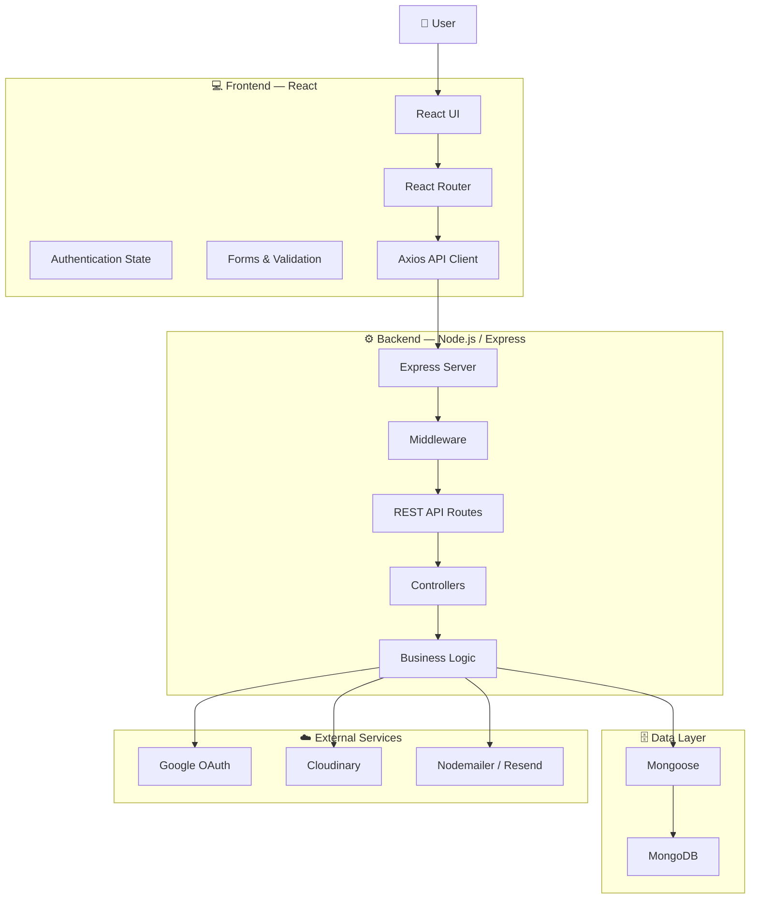

# 🚀 DevHub

<p align="center">
  <strong>A modern full-stack developer platform built with React and Node.js</strong>
</p>

<p align="center">
  <a href="https://github.com/ankushsharawatt/DevHub">
    
  </a>
  <a href="https://github.com/ankushsharawatt/DevHub">
    
  </a>
  
  
  
</p>

<p align="center">
  <a href="#-features">Features</a> •
  <a href="#-tech-stack">Tech Stack</a> •
  <a href="#-architecture">Architecture</a> •
  <a href="#-api-documentation">API</a> •
  <a href="#-screenshots">Screenshots</a> •
  <a href="#-installation">Installation</a>
</p>

---

## 📖 About

**DevHub** is a full-stack web application built to provide a modern, secure and scalable platform with user authentication, profiles, product management and category management.

The project follows a separated frontend/backend architecture:

* **Frontend:** React-based single-page application
* **Backend:** REST API powered by Node.js and Express
* **Database:** MongoDB with Mongoose
* **Authentication:** JWT + Google OAuth 2.0
* **Media:** Cloudinary
* **Email:** Nodemailer / Resend

The application also includes protected routes, email verification, password recovery, profile management and image uploads.

---

## ✨ Features

### 🔐 Authentication

* User registration
* User login
* JWT authentication
* Email verification
* Forgot password
* Reset password
* Change email verification
* Google OAuth 2.0
* Protected routes
* Session management with Passport

### 👤 User Management

* User profiles
* Profile editing
* Authenticated dashboard
* Protected user resources

### 📦 Product Management

* Product creation and management
* Product categories
* Image uploads
* Cloudinary integration
* RESTful API endpoints

### 🎨 Frontend

* React 19
* React Router
* Responsive UI
* Tailwind CSS
* Ant Design components
* Toast notifications
* Form validation
* Loading states
* Dark-mode compatible interface

---

## 🛠️ Tech Stack

### Frontend

| Technology      | Purpose             |
| --------------- | ------------------- |
| React 19        | UI                  |
| React Router    | Client-side routing |
| Axios           | API communication   |
| Tailwind CSS    | Styling             |
| Ant Design      | UI components       |
| React Hook Form | Form handling       |
| Yup             | Validation          |
| React Hot Toast | Notifications       |
| Lucide React    | Icons               |

### Backend

| Technology       | Purpose                   |
| ---------------- | ------------------------- |
| Node.js          | Runtime                   |
| Express 5        | REST API                  |
| MongoDB          | Database                  |
| Mongoose         | ODM                       |
| JWT              | Authentication            |
| Passport.js      | OAuth authentication      |
| Google OAuth 2.0 | Social login              |
| Cloudinary       | Image storage             |
| Multer           | File uploads              |
| Nodemailer       | Email                     |
| Resend           | Email delivery            |
| bcrypt           | Password hashing          |
| dotenv           | Environment configuration |

---

# 🏗️ Architecture

DevHub uses a **client-server architecture** where the React frontend communicates with the Express REST API.



### Request Flow

```text
User
 │
 ▼
React Frontend
 │
 │ HTTP / REST API
 ▼
Express Server
 │
 ├── Authentication Middleware
 ├── Route
 ├── Controller
 └── Business Logic
        │
        ├── MongoDB
        ├── Cloudinary
        ├── Google OAuth
        └── Email Service
```

---

# 📁 Project Structure

```text
DevHub/
│
├── client/
│   ├── public/
│   │
│   ├── src/
│   │   ├── components/
│   │   ├── layouts/
│   │   ├── pages/
│   │   ├── App.jsx
│   │   ├── ProtectedRoute.jsx
│   │   └── index.js
│   │
│   ├── package.json
│   └── ...
│
├── server/
│   ├── config/
│   │   └── passport.js
│   │
│   ├── controllers/
│   ├── middleware/
│   ├── models/
│   ├── routes/
│   ├── utils/
│   ├── uploads/
│   │
│   ├── index.js
│   └── package.json
│
└── README.md
```

---

# 🔑 Authentication Architecture

DevHub supports both traditional authentication and OAuth.

```text
                    ┌───────────────┐
                    │     User      │
                    └───────┬───────┘
                            │
              ┌─────────────┴─────────────┐
              │                           │
              ▼                           ▼
       Email / Password              Google OAuth
              │                           │
              ▼                           ▼
       Password Hashing              Passport.js
              │                           │
              └─────────────┬─────────────┘
                            ▼
                    Authentication
                            │
                            ▼
                       JWT / Session
                            │
                            ▼
                    Protected Routes
```

---

# 📡 API Documentation

Base URL:

```text
http://localhost:8080/api
```

## 🔐 Authentication

### Register

```http
POST /api/auth/register
```

Example request:

```json
{
  "name": "John Doe",
  "email": "john@example.com",
  "password": "password123"
}
```

### Login

```http
POST /api/auth/login
```

### Email Verification

```http
GET /api/auth/verify-email
```

### Forgot Password

```http
POST /api/auth/forgot-password
```

### Reset Password

```http
POST /api/auth/reset-password
```

### Google Authentication

```http
GET /api/auth/google
```

---

## 📂 Categories

Base route:

```text
/api/categories
```

Typical operations:

```http
GET    /api/categories
POST   /api/categories
PUT    /api/categories/:id
DELETE /api/categories/:id
```

---

## 📦 Products

Base route:

```text
/api/products
```

Typical operations:

```http
GET    /api/products
GET    /api/products/:id
POST   /api/products
PUT    /api/products/:id
DELETE /api/products/:id
```

> Exact request bodies and authorization requirements should be verified against the corresponding route/controller implementation before using these examples in production documentation.

---

# 🖥️ Screenshots

> Add real screenshots from the application here.

### 🏠 Home


### 🔐 Login


### 📝 Register


### 📊 Dashboard


